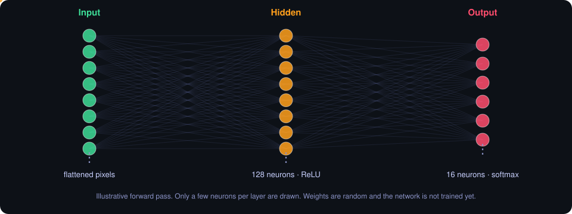
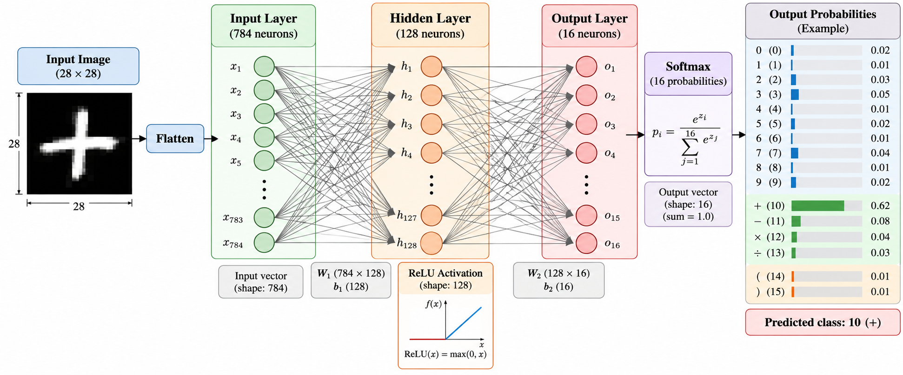

<div align="center">




</div>

---

## What is P.R.I.S.M.?

P.R.I.S.M. is a neural network project that aims to recognise handwritten mathematical symbols. Given a 28×28 image, the finished system should say whether it is a **digit**, a **mathematical operator**, or a **bracket**.

The network is written by hand with NumPy instead of using a deep learning framework, so every step (forward pass, loss, and later backpropagation and weight updates) is something I write and understand myself.

> **Status:** the data pipeline, the forward pass and the loss calculation are done. **The network does not learn yet.** Backpropagation and gradient descent are the next step, so the weights are still random and predictions are essentially guesses.

---

## What's implemented so far

Everything lives in [`main.py`](main.py), which currently runs top to bottom as a script.

| Stage | Status |
|-------|:------:|
| Load dataset from `.npz` and inspect shapes, dtypes, min/max | ✅ |
| Visualise a sample image with its label | ✅ |
| Normalise pixels to [0, 1] and flatten each image into a vector | ✅ |
| Count samples per class | ✅ |
| Random weight initialisation, zero biases | ✅ |
| Forward pass: hidden layer (ReLU) and output layer (softmax) | ✅ |
| Cross-entropy loss (single sample and averaged over the whole dataset) | ✅ |
| One-hot encoding | 🔜 |
| Backpropagation, gradient calculation, gradient descent | 🔜 |
| Training loop, evaluation, visualisation | 🔜 |
| Hyperparameter experiments | 🔜 |
| Saving the model and a prediction pipeline | 🔜 |

---

## How the network currently works

Data flows left to right through the network. The animation below is an illustration of that forward pass, not a recording of real values.

<div align="center">



</div>

The diagram below shows the architecture the code implements. The probability bars on the right are an **illustrative example**, not output from a trained model.

<div align="center">



</div>

**Data preparation**

1. The images (`img`) and labels (`label`) are loaded from `Data/extend_mnist_eval.npz`.
2. Pixel values are divided by 255 so they fall between 0 and 1.
3. Each image is flattened into a single row, so the dataset becomes a 2D matrix with one sample per row.
4. Labels are cast to integers.

**Forward pass**

```python
z1 = np.dot(x, w1) + b1        # hidden layer pre-activation
A1 = relu(z1)                  # ReLU: max(0, z)
z2 = np.dot(A1, w2) + b2       # output layer pre-activation
A2 = softmax(z2)               # one probability per class, rows sum to 1
```

| Layer | Size | Notes |
|-------|------|-------|
| Input | one value per pixel (28×28 flattened) | normalised to [0, 1] |
| Hidden | 128 neurons | ReLU, weights from `np.random.randn`, biases start at zero |
| Output | 16 neurons | softmax, weights from `np.random.randn`, biases start at zero |

**Loss**

The loss is categorical cross-entropy. For each sample it takes the probability the network gave to the correct class, applies `-log`, and then averages over all samples. A small epsilon (`1e-8`) is added inside the log to avoid `log(0)`. The integer labels are used directly to index into the softmax output, so one-hot encoding isn't needed for this step yet; it will come with the backward pass.

$$L = -\frac{1}{N}\sum_{n=1}^{N}\log\left(\hat{y}_{n,\,y_n} + \varepsilon\right)$$

Since the weights are random and untrained, the loss value you get right now just reflects a network that has not learned anything.

---

## The 16 classes

The output layer has 16 neurons, one per class. The diagram above shows the intended class layout:

| Labels | Symbols |
|:------:|---------|
| 0 – 9 | digits `0`–`9` |
| 10 – 13 | operators `+` `−` `×` `÷` |
| 14 – 15 | brackets `(` `)` |

The script prints the unique labels and the number of samples in each class, so you can check the label distribution of your copy of the dataset.

---

## Project structure

```
P.R.I.S.M./
├── main.py          # data loading, preprocessing, forward pass, loss
├── Data/
│   └── extend_mnist_eval.npz   # dataset file read by main.py
├── assets/
│   ├── banner.svg              # animated header
│   ├── forward-pass.svg        # animated forward-pass illustration
│   └── architecture.png        # network diagram used in this README
└── README.md
```

---

## Running it

`main.py` needs **Python 3**, **NumPy** and **Matplotlib**:

```bash
pip install numpy matplotlib
python main.py
```

It expects the dataset at `Data/extend_mnist_eval.npz`, with `img` and `label` arrays. The script prints dataset information, opens a window with the first image, and then prints the forward-pass output and loss.

> The path in `main.py` is written with a Windows-style backslash (`Data\extend_mnist_eval.npz`). On Linux or macOS, change it to `Data/extend_mnist_eval.npz`.

---

## Future Development

The next stage of this project will focus on completing the neural network and turning it into a functional handwritten mathematical symbol recognition system. The remaining work includes implementing **one-hot encoding, backpropagation, gradient calculation, and gradient descent** so that the network can learn from its errors and update its weights and biases. After that, I will train the model over multiple epochs while tracking **loss and accuracy**, evaluate its performance on the test dataset, and visualize the training process and predictions. I will then experiment with different **learning rates, hidden-layer sizes, and other hyperparameters** to understand their effect on performance. Finally, I will save the trained model parameters and build a simple prediction pipeline that can take a new 28×28 handwritten image and classify it as a digit, mathematical operator, or bracket.

### Roadmap

- [x] Load and inspect the dataset
- [x] Normalise and flatten the images
- [x] Forward pass (ReLU hidden layer, softmax output)
- [x] Cross-entropy loss
- [ ] One-hot encoding of labels
- [ ] Backpropagation and gradient calculation
- [ ] Gradient descent (weight and bias updates)
- [ ] Multi-epoch training with loss and accuracy tracking
- [ ] Evaluation on the test dataset
- [ ] Visualisation of training and predictions
- [ ] Experiments with learning rate, hidden-layer size and other hyperparameters
- [ ] Save trained parameters
- [ ] Prediction pipeline for a new 28×28 image

### The intended end result

```
handwritten 28×28 image  →  normalise + flatten  →  trained network  →  digit · operator · bracket
```

Once finished, you should be able to give the saved model a new handwritten image and get back its predicted class. This pipeline does not exist yet.

---

## Author

**Abhinav Jha**, B.Tech CSE, Jaypee University of Information Technology (JUIT), Solan
[GitHub: @abhinavxjha](https://github.com/abhinavxjha)
