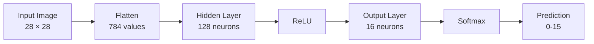

```mermaid
flowchart LR

    A["Input Image<br>28 × 28"] --> B["Flatten<br>784 values"]

    B --> C["Hidden Layer<br>128 neurons"]

    C --> D["ReLU"]

    D --> E["Output Layer<br>16 neurons"]

    E --> F["Softmax"]

    F --> G["Prediction<br>0-15"]
```